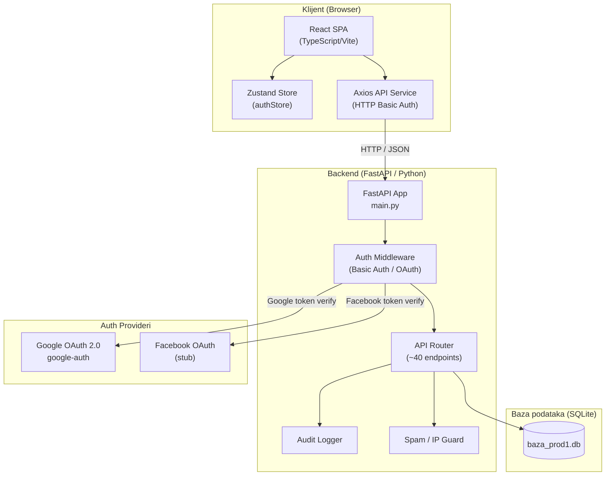
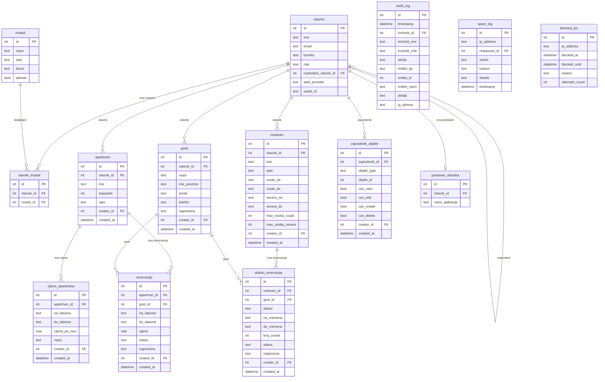
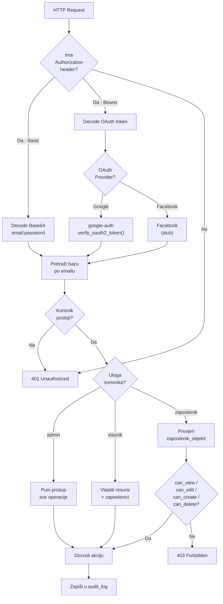
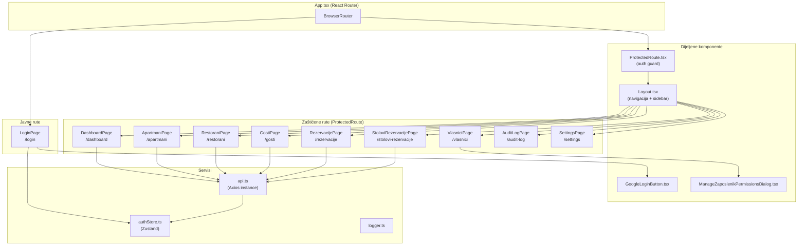
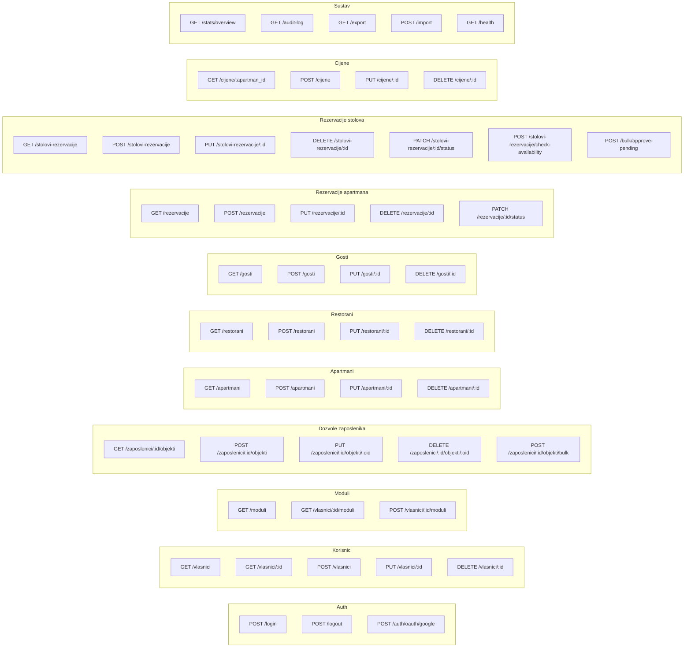
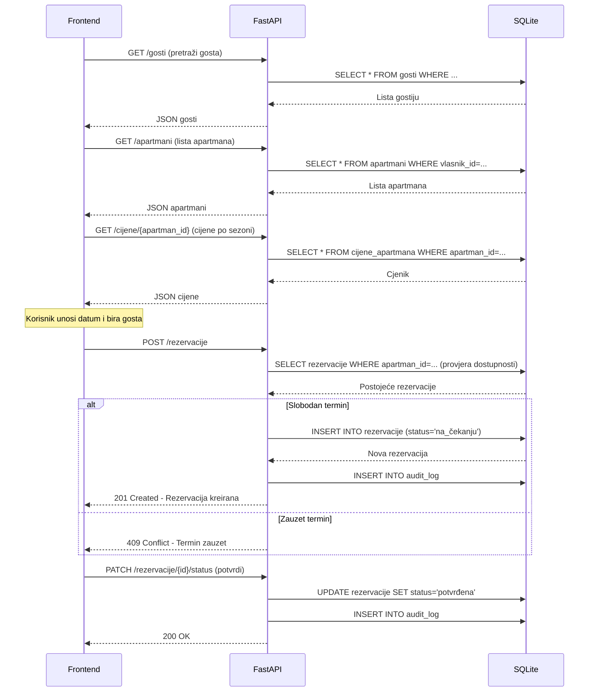
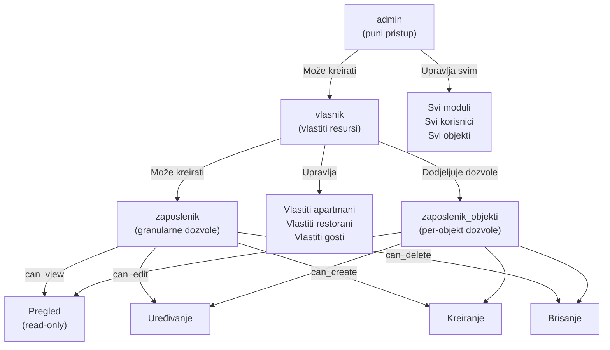
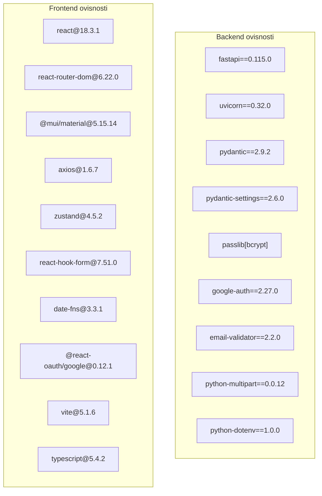
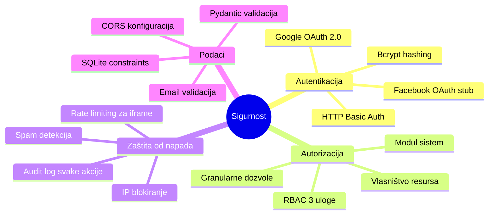

# Projektni Assessment: Apartmani & Restorani Management System

**Datum:** 2026-03-20
**Verzija:** 1.0.0
**Status:** Produkcijski spreman

---

## 1. Pregled projekta

Full-stack web aplikacija za upravljanje rezervacijama apartmana i restorana s višekorisničkom arhitekturom, granularnim dozvolama i OAuth integracijom.

| Komponenta | Tehnologija |
|------------|-------------|
| Backend    | Python / FastAPI |
| Frontend   | TypeScript / React / Vite |
| Baza       | SQLite |
| Auth       | HTTP Basic Auth + Google OAuth 2.0 |
| UI         | Material-UI (MUI) |
| State      | Zustand |

---

## 2. Arhitektura sustava



---

## 3. Struktura direktorija

```
crnikav1/
├── backend/
│   ├── main.py                  # FastAPI aplikacija (~2591 linija)
│   ├── models.py                # Pydantic modeli i sheme
│   ├── init_db.py               # Inicijalizacija baze
│   ├── migrate_add_status.py    # DB migracija
│   ├── requirements.txt         # Python ovisnosti
│   ├── .env                     # Konfig (Google OAuth)
│   ├── auth/
│   │   ├── base.py              # Apstraktni OAuthProvider
│   │   ├── google.py            # Google OAuth implementacija
│   │   └── facebook.py          # Facebook OAuth (stub)
│   └── baza_prod1.db            # SQLite baza
│
├── frontend/
│   └── src/
│       ├── App.tsx              # Korijenska komponenta / routing
│       ├── main.tsx             # React entry point
│       ├── pages/               # Stranice
│       ├── components/          # Dijelovi UI-a
│       ├── services/api.ts      # Axios HTTP klijent
│       ├── store/authStore.ts   # Zustand auth stanje
│       └── types/index.ts       # TypeScript tipovi
│
├── DEPLOYMENT.md
├── README.md
└── ASSESSMENT.md                # Ovaj dokument
```

---

## 4. Dijagram baze podataka (ER)



---

## 5. Autentikacija i autorizacija



---

## 6. Frontend komponente



---

## 7. API endpoint mapa



---

## 8. Tijek rezervacije apartmana



---

## 9. Uloge i dozvole



---

## 10. Stack ovisnosti



---

## 11. Sigurnosni aspekti



---

## 12. Sažetak i preporuke

### Snage
- Kompletna CRUD funkcionalnost za sve entitete
- Granularne dozvole na razini pojedinog objekta
- Sveobuhvatno audit logiranje
- Višestruki načini prijave (password + OAuth)
- Multi-tenant arhitektura

### Potencijalna poboljšanja
| Prioritet | Poboljšanje | Razlog |
|-----------|-------------|--------|
| Visok | Migracija na PostgreSQL | SQLite nije optimalan za produkciju s više korisnika |
| Visok | JWT tokeni umjesto Basic Auth | Sigurniji, standardniji pristup |
| Srednji | Refresh tokeni za OAuth sessione | Trenutni `oauth_<timestamp>` token je nestandardan |
| Srednji | Alembic migracije | Upravljanje shemom baze bez ručnih skripti |
| Nizak | Facebook OAuth implementacija | Stub nije funkcionalan |
| Nizak | E-mail notifikacije | Obavijesti za rezervacije |
| Nizak | Redis cache | Caching za statistike i popise |

---

*Generirano: 2026-03-20 | crnikav1 v1.0.0*
