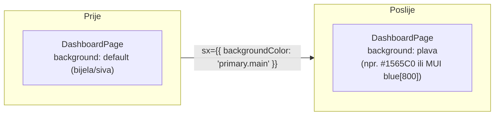
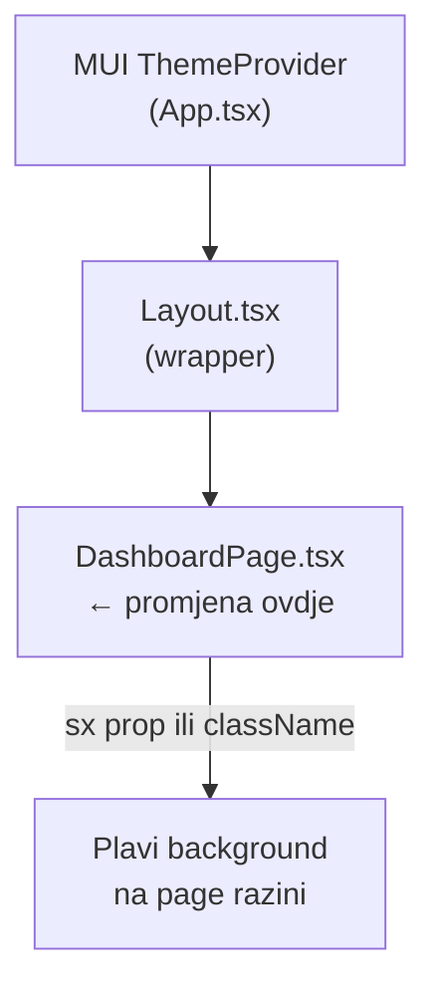

# 0001 — Plavi background na Dashboard stranici

**Status:** Done
**Prioritet:** Nizak
**Datum kreiranja:** 2026-03-20

---

## 1. Cilj

Promijeniti pozadinsku boju Dashboard stranice u plavu kako bi se vizualno razlikovala od ostalih stranica i dala jasniji identitet glavnom pregledu sustava.

---

## 2. Opseg promjena

| Datoteka | Tip promjene |
|----------|--------------|
| `frontend/src/pages/DashboardPage.tsx` | Stilska promjena — dodati plavi background |

Potencijalno zahvaćeno:
- MUI `sx` prop ili `styled` komponenta unutar `DashboardPage`
- Moguće globalni theme ako se koristi MUI `ThemeProvider`

---

## 3. Dijagram (Mermaid)

---

## 4. Implementacijski koraci

1. Otvoriti `frontend/src/pages/DashboardPage.tsx`
2. Pronaći korijeni `Box` ili `Container` element koji wrapa cijelu stranicu
3. Dodati `sx={{ backgroundColor: 'primary.dark' }}` ili konkretnu hex vrijednost
4. Provjeriti kontrast teksta (MUI `color: 'white'` ako je pozadina tamno plava)
5. Testirati vizualno na dev serveru (`npm run dev`)

---

## 5. Prihvatni kriteriji

- [ ] Dashboard stranica ima vidljivo plavu pozadinu
- [ ] Sav tekst na stranici je čitljiv (dovoljan kontrast)
- [ ] Ostale stranice su **neizmijenjene**
- [ ] Nema grešaka u konzoli

---

## 6. Napomene / Rizici

- Ako `DashboardPage` nema vlastiti wrapper element, možda je potrebno dodati wrapping `Box`
- MUI tema definira `primary.main`, `primary.dark` itd. — koristiti tematske boje za konzistentnost
- Ako se koristi globalni `background` u `Layout.tsx`, promjena tamo bi utjecala na sve stranice — izbjegavati
