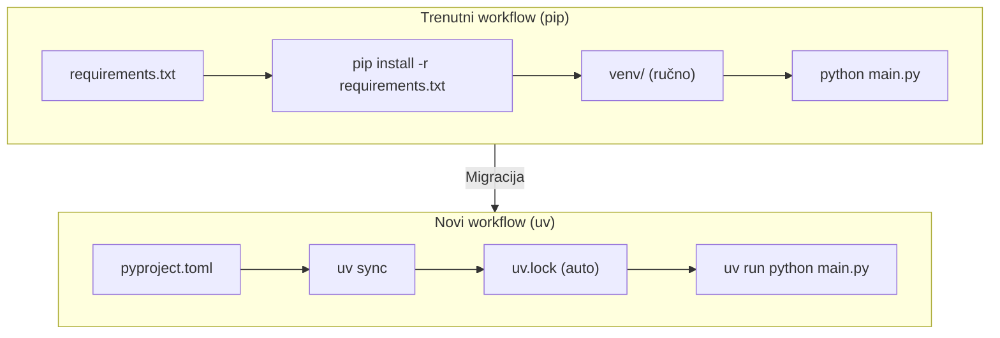
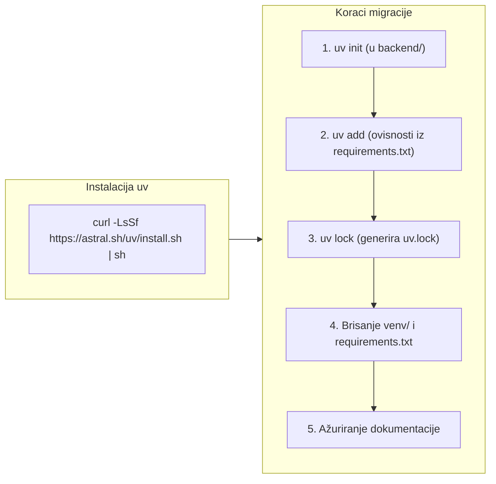

# 0002 — Migracija Python projekta na uv package manager

**Status:** Draft
**Prioritet:** Srednji
**Datum kreiranja:** 2026-03-20

---

## 1. Cilj

Zamijeniti trenutni `pip` + `venv` + `requirements.txt` workflow s **uv** package managerom. uv je znatno brži, determinističan (lock file), i moderan standard za Python projekte. Migracija ne smije promijeniti ponašanje aplikacije.

---

## 2. Opseg promjena

| Datoteka / Direktorij | Tip promjene |
|-----------------------|--------------|
| `backend/requirements.txt` | Zadržati kao referenca, zamijeniti s `pyproject.toml` |
| `backend/pyproject.toml` | Kreirati — novi primarni konfig |
| `backend/uv.lock` | Kreirati — lock file (auto-generiran) |
| `backend/venv/` | Obrisati — uv upravlja env automatski |
| `backend/.python-version` | Kreirati — definira Python verziju |
| `DEPLOYMENT.md` | Ažurirati upute za pokretanje |
| `README.md` | Ažurirati upute za razvoj |

---

## 3. Dijagram (Mermaid)





---

## 4. Implementacijski koraci

### 4.1 Instalacija uv (jednom po razvojnom stroju)
```bash
curl -LsSf https://astral.sh/uv/install.sh | sh
```

### 4.2 Inicijalizacija projekta
```bash
cd backend
uv init --no-workspace
```

### 4.3 Dodavanje ovisnosti iz requirements.txt
```bash
uv add fastapi==0.115.0
uv add uvicorn==0.32.0
uv add pydantic==2.9.2
uv add pydantic-settings==2.6.0
uv add "passlib[bcrypt]"
uv add google-auth==2.27.0
uv add email-validator==2.2.0
uv add python-multipart==0.0.12
uv add python-dotenv==1.0.0
```

### 4.4 Definirati Python verziju
```bash
echo "3.12" > backend/.python-version
```

### 4.5 Verifikacija
```bash
uv run python main.py
# Aplikacija mora startati bez grešaka
```

### 4.6 Cleanup
```bash
rm -rf backend/venv/
# requirements.txt zadržati kao historijsku referencu ili obrisati
```

### 4.7 Ažurirati dokumentaciju
- `DEPLOYMENT.md` — zamijeniti pip naredbe s uv ekvivalentima
- `README.md` — ažurirati "Getting Started" sekciju

---

## 5. Prihvatni kriteriji

- [ ] `backend/pyproject.toml` postoji i sadrži sve ovisnosti
- [ ] `backend/uv.lock` postoji (committan u git)
- [ ] `uv run python main.py` pokreće backend bez grešaka
- [ ] `uv run python init_db.py` inicijalizira bazu bez grešaka
- [ ] `backend/venv/` ne postoji (uv koristi vlastiti cache)
- [ ] `DEPLOYMENT.md` i `README.md` ažurirani
- [ ] `.gitignore` ažuriran (dodati `.venv` ako uv kreira lokalni env)

---

## 6. Napomene / Rizici

- `uv` automatski kreira `.venv` u direktoriju projekta pri `uv sync` — dodati u `.gitignore`
- `pyproject.toml` zamjenjuje `requirements.txt` kao source of truth za ovisnosti
- `uv.lock` **mora biti committan** u git — osigurava reproducibilne buildove
- Provjeri je li Python 3.12 dostupan na produkcijskom serveru
- `passlib[bcrypt]` — pazi na syntax u `uv add "passlib[bcrypt]"` (navodnici zbog `[`)
