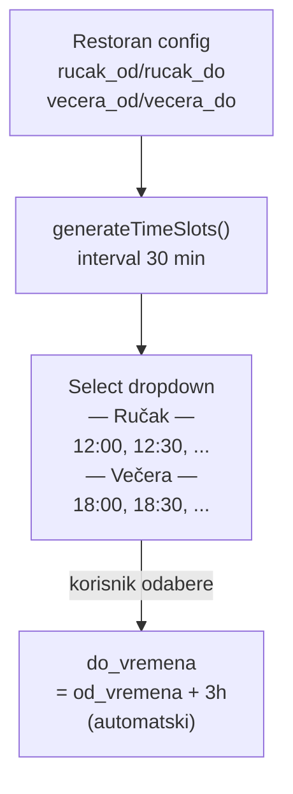

# 0003 — Dropdown za odabir početka vremena rezervacije stola

**Status:** Done
**Prioritet:** Srednji
**Datum kreiranja:** 2026-03-20

---

## 1. Cilj

Zamijeniti slobodni time picker (input type="time") za polje `od_vremena` na formi rezervacije stola s dropdown listom fiksnih vremenskih slotova u intervalima od 30 minuta, baziranih na konfiguraciji radnog vremena odabranog restorana (ručak i večera).

---

## 2. Opseg promjena

| Datoteka | Tip promjene |
|----------|--------------|
| `frontend/src/pages/StoloviRezervacijePage.tsx` | Zamjena TextField (type="time") sa Select dropdownom |

---

## 3. Dijagram (Mermaid)

---

## 4. Implementacijski koraci

1. Dodati `watch('restoran_id')` za praćenje odabranog restorana
2. Implementirati `generateTimeSlots(od, do)` — generira stringove "HH:MM" od `od` (uključivo) do `do` (isključivo) u koracima od 30 min
3. Izračunati `rucakSlots` i `veceraSlots` na temelju konfiguracije odabranog restorana
4. Zamijeniti `<TextField type="time">` za `od_vremena` s `<Select>` koji prikazuje slotove grupirane pod "— Ručak —" i "— Večera —"
5. Ako restoran nije odabran, pokazati disabled opciju "Odaberite restoran"
6. Ukloniti uvjet `!editingRezervacija` iz auto-kalkulacije `do_vremena` kako bi se +3h primjenjivalo i pri editiranju

---

## 5. Logika generiranja slotova

Primjer: `rucak_od = "12:00"`, `rucak_do = "15:00"`
→ Slotovi: `12:00`, `12:30`, `13:00`, `13:30`, `14:00`, `14:30`

Zadnji slot je uvijek 30 min prije vremena `_do` (isključivo).

`do_vremena` se uvijek automatski postavlja na `od_vremena + 3 sata`.

---

## 6. Prihvatni kriteriji

- [x] Polje `od_vremena` je dropdown, ne slobodni time picker
- [x] Slotovi su u intervalima od 30 minuta
- [x] Slotovi se baziraju na `rucak_od/rucak_do` i `vecera_od/vecera_do` odabranog restorana
- [x] Ručak i večera su vizualno odvojeni u dropdownu
- [x] `do_vremena` se automatski postavlja na `od_vremena + 3h`
- [x] Radi i pri kreiranju i pri editiranju rezervacije

---

## 7. Napomene / Rizici

- Ako restoran nema popunjene sate (edge case), dropdown prikazuje "Odaberite restoran"
- Postojeće rezervacije s proizvoljnim vremenima (prije ove promjene) mogu prikazati prazan odabir u dropdownu pri editiranju — prihvatljivo jer su stari podaci
